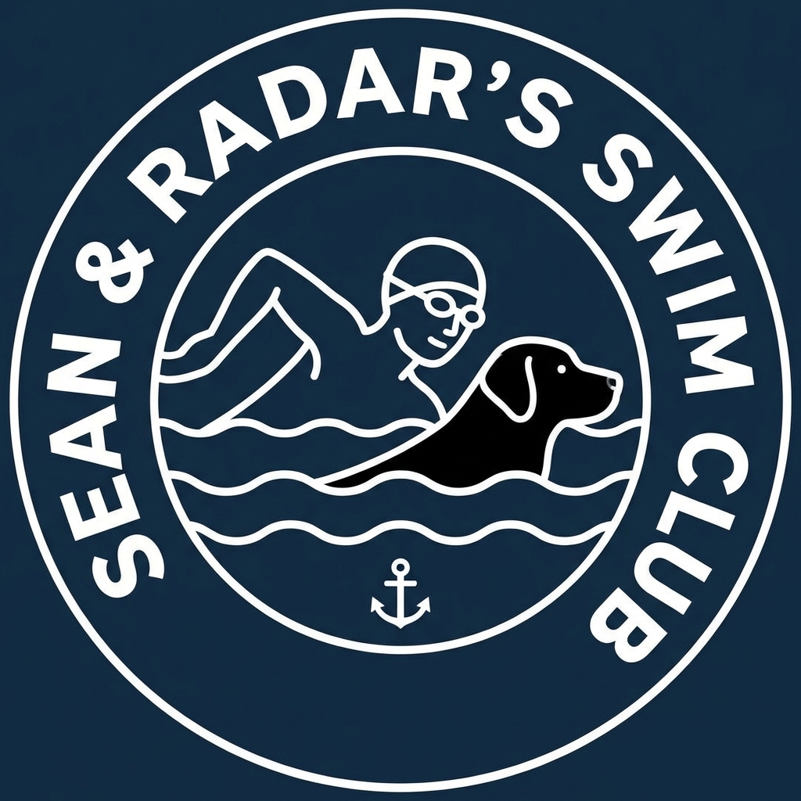

# Sean & Radar's Swim Club Dashboard 🌊🐶

Dashboard for **Tarbert, Co. Kerry**, designed for open water swimmers who want accurate tide times, weather conditions, and sea temperature data.

## ✨ Features

- **Live Weather**: Real-time temperature, conditions, and rainfall data powered by Open-Meteo
- **Accurate Tide Times**: Precise high and low tide predictions using official Tarbert Island tide tables
- **Sea Conditions**: Live sea temperature and wave height monitoring
- **Weekly Tide Schedule**: 7-day tide forecast with visual indicators
- **4-Day Weather Forecast**: Extended outlook to plan your swims ahead
- **Responsive Design**: Optimized for mobile, tablet (iPad), and desktop with a sleek dark mode UI
- **Real-time Charts**: Visual rainfall and tide level graphs updated every 15 minutes

## 🚀 Live Demo

Visit the live dashboard: **[https://reidycolm.github.io/sean-swims/](https://reidycolm.github.io/sean-swims/)**

## 📱 Screenshots

The dashboard is fully responsive and looks great on all devices:
- **Desktop**: Full 2-column grid layout with all cards visible
- **Tablet/iPad**: Optimized 2-column layout with prioritized information
- **Mobile**: Stacked single-column layout, perfect for quick checks before a swim

## 🛠️ Technology Stack

- **HTML5** - Semantic structure
- **CSS3** - Custom responsive design with CSS Grid and Flexbox
- **JavaScript (ES6+)** - Dynamic data fetching and rendering
- **Chart.js** - Beautiful, interactive charts
- **Feather Icons** - Clean, minimal iconography
- **Open-Meteo API** - Weather and marine data
- **Tarbert Island Tide Tables** - Official 2026 tide predictions

## 📊 Data Sources

- **Weather Data**: [Open-Meteo](https://open-meteo.com/) - Free weather API
- **Tide Data**: Tarbert Island Tide Table 2026 (Official)
- **Marine Data**: Open-Meteo Marine API for wave height and sea temperature

## 🏊‍♂️ Usage

Simply open the dashboard in your browser to see:
- Current weather conditions in Tarbert
- Today's tide times (next high & low)
- Current sea temperature and wave height
- Rainfall forecast for the next 24 hours
- Weekly tide schedule

The dashboard automatically refreshes every 15 minutes to keep data current.

## 📄 License

This project is open source and available for personal use.

## 🙏 Credits

- **Icons**: [Feather Icons](https://feathericons.com/)
- **Charts**: [Chart.js](https://www.chartjs.org/)
- **Fonts**: [Google Fonts - Inter & JetBrains Mono](https://fonts.google.com/)

---

*Built for Sean & Radar 🐾*

*Stay safe and enjoy the waters of Tarbert!*

## Tide implementation and validation

Tides are stored separately in `data/tides-2026.js`; source provenance, coverage,
timezone rules and maintenance instructions are in [data/README.md](data/README.md).
The supplied Tarbert Island table now covers September through December 2026.
The existing January-August entries are preserved. Coverage ends on 31 December;
missing data is shown explicitly rather than replaced by an assumed tide level.

`tides.js` handles Dublin civil dates, chronological event searches, countdowns
and presentation-only interpolation. `tide-ui.js` renders next highs/lows, today's
sequence and the seven-day schedule. Tide countdowns refresh every minute and do
not wait for weather requests; weather and marine requests refresh every 15 minutes.
The curve is visual interpolation between exact table events, not a live level sensor.

### Local use and GitHub Pages

Open `index.html`, or serve the project with a static server such as
`python -m http.server 8000` and visit `http://localhost:8000/`.
No package installation, build step or application backend is needed to run it.
Weather, marine data, Chart.js, fonts and icons use external services.

For GitHub Pages, publish the repository root using the repository's Pages settings.
There is no checked-in deployment workflow. Asset paths, manifest scope/start URL,
and service-worker registration are relative, supporting both `/sean-swims/` and a
local server root. The service worker runs only over HTTP(S), with localhost or
HTTPS required by the browser. After an online visit, the static tide data is
available offline; live conditions and uncached CDN resources still need a connection.

### Checks

Run `node --test tests/tides.test.js` for source fixtures, legacy preservation,
coverage, chronological searches, timezone/clock-change behaviour and missing-data
checks. The tests also pass with `TZ=America/Los_Angeles` and `TZ=Asia/Tokyo`.

`tests/browser-check.cjs` is an optional Playwright/Edge check. Install Playwright
separately to run it; it is not an application dependency. The script launches its
own temporary static server and a fresh headless browser, checks desktop, tablet,
390 px and 320 px layouts, console errors, Pages/root service-worker scopes, the
October clock change, year-end availability and offline tide loading. Screenshots
and its report are written to `tmp/browser/`.
